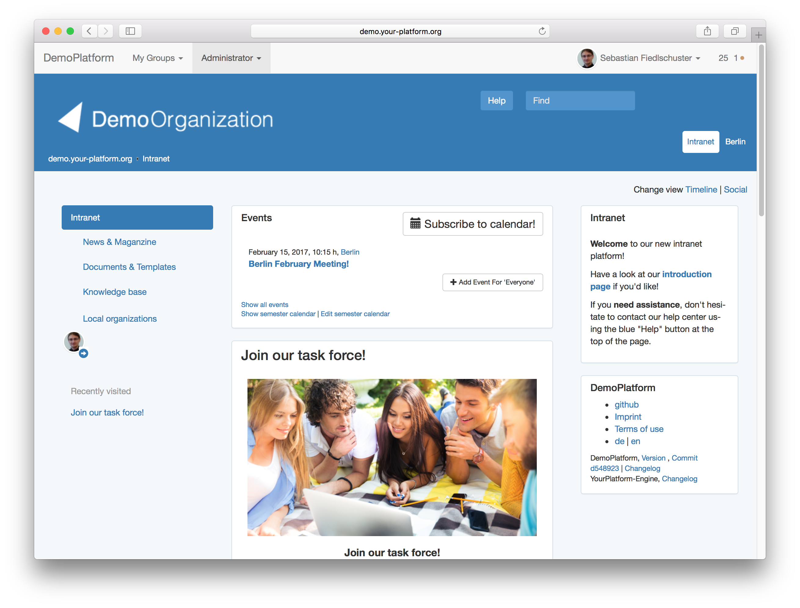

# YourPlatform

[](https://gitter.im/fiedl/your_platform?utm_source=badge&utm_medium=badge&utm_campaign=pr-badge&utm_content=badge)
[](http://badge.fury.io/rb/your_platform)
[](https://travis-ci.org/fiedl/your_platform)
[](https://codeclimate.com/github/fiedl/your_platform)

YourPlatform is a [ruby on rails](http://rubyonrails.org) engine that provides the basis for administrtive and social network platforms for closed user groups such as alumni organizations.

The application serves four main purposes: Centralized or decentralized member management, networking features for members, exchange of information and documents and communication.



## Getting Started Developing

Install [Docker](https://www.docker.com/community-edition#/download) including *docker-compose* on your development machine.

Then check out and start the standalone application:

```bash
git clone git@github.com:fiedl/your_platform.git
cd your_platform

docker-compose up
```

Open [http://localhost:3001](http://localhost:3001) in your web browser.

**Attention**: Do not use this in production on a real server as [docker-compose.yml](https://github.com/fiedl/your_platform/blob/master/docker-compose.yml) includes dummy passwords!

If you want to create an application based on the YourPlatform engine, please follow the [GETTING STARTED GUIDE](https://github.com/fiedl/your_platform/wiki/GettingStarted) in the wiki.

If you have any troubles, **feel free to contact us on our [gitter channel](https://gitter.im/fiedl/your_platform)**.

## Documentation

Our [code documentation can be found on rubydoc.info](http://www.rubydoc.info/github/fiedl/your_platform).


## Contributing

1. Fork it
2. Create your feature branch (`git checkout -b my-new-feature`)
3. Commit your changes (`git commit -am 'Add some feature'`)
4. Push to the branch (`git push origin my-new-feature`)
5. Create new Pull Request


## Authors and License

**Copyright** (c) 2012-2018, Sebastian Fiedlschuster

**Contributors**: Jörg Reichardt, Manuel Zerpies, Joachim Back

**License**: The Source Code is released under the GNU Affero General Public License (AGPL). Explicitely excluded are the images and fonts.

This program is distributed in the hope that it will be useful, but WITHOUT ANY WARRANTY; without even the implied warranty of MERCHANTABILITY or FITNESS FOR A PARTICULAR PURPOSE. See the GNU Affero General Public License for more details.

You should have received a copy of the GNU Affero General Public License along with this program. If not, see http://www.gnu.org/licenses/.
